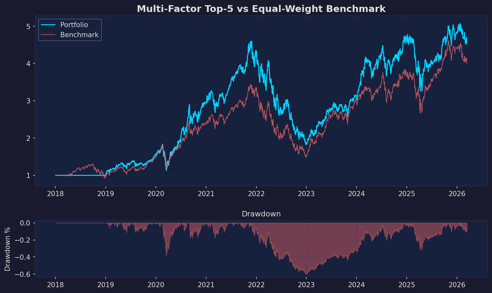
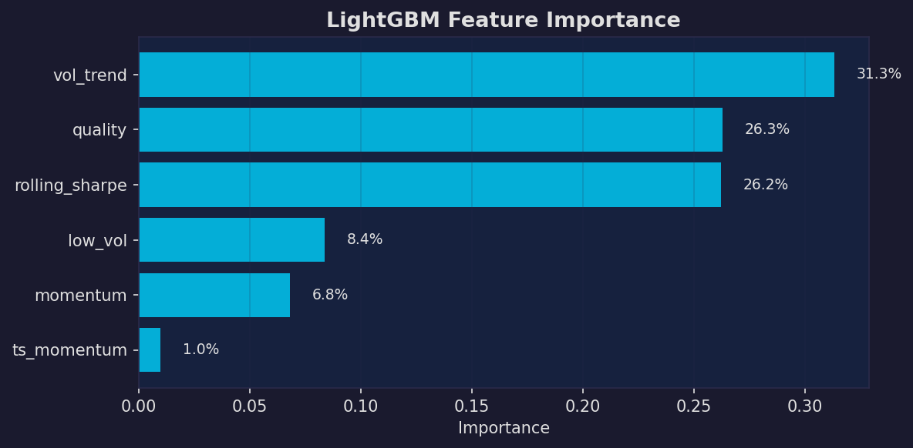
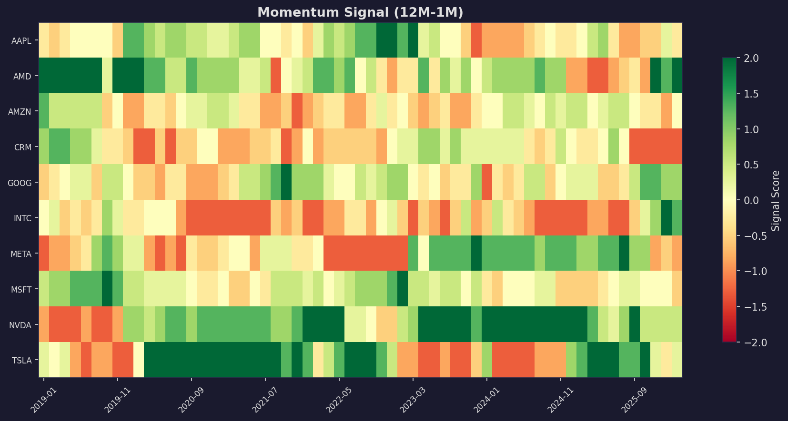
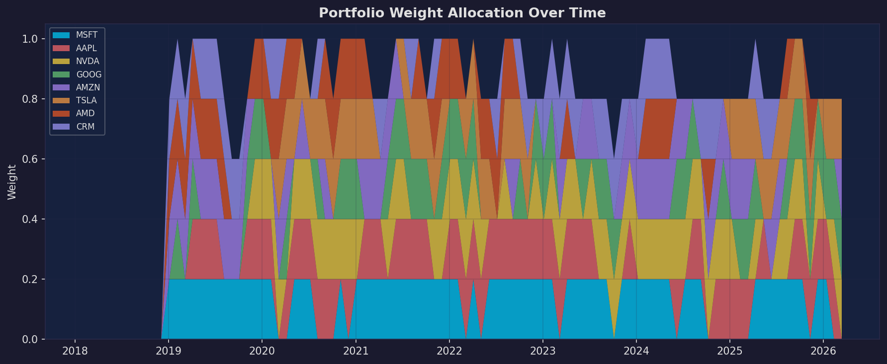

<p align="center">
  <h1 align="center">QuantPortal</h1>
  <p align="center">
    <strong>ML-Driven Multi-Signal Portfolio Optimizer</strong>
  </p>
  <p align="center">
    <em>From factor signals to optimized portfolios — momentum, volatility, quality factors combined with LightGBM and mean-variance optimization.</em>
  </p>
</p>

<p align="center">
  
  
  
  
  
  
</p>

---

## What is QuantPortal?

**QuantPortal** picks up where [MarketDNA](https://github.com/koriyoshi2041/MarketDNA) leaves off.

MarketDNA answers *"What does this asset look like?"* — QuantPortal answers *"What should I actually buy, and how much?"*

| Module | What it does | Key Insight |
|--------|-------------|-------------|
| **Momentum Factor** | 12M-1M cross-sectional + time-series momentum | Rank-based z-score avoids outlier sensitivity |
| **Volatility Factor** | Low-vol anomaly, vol-of-vol, vol trend | Low-vol stocks consistently outperform high-vol |
| **Quality Factor** | Rolling Sharpe, drawdown resilience, tail risk | Price-based quality proxy without fundamentals |
| **Pair Scanner** | Automated cointegration discovery across universe | Bonferroni correction for multiple testing |
| **Portfolio Optimizer** | Max Sharpe, Min Variance, Risk Parity | CVXPY-based with position limits |
| **ML Signal Combiner** | LightGBM regime-conditional signal weighting | Trees capture non-linear factor interactions |
| **Backtest Engine** | Walk-forward with transaction costs + turnover | Anti-overfitting by design |

---

## Demo Output

### Portfolio Equity Curve — Factor Top-5 vs Equal-Weight

<p align="center">
  
</p>

> Multi-factor top-5 portfolio (blue) vs equal-weight benchmark (red). Factor selection identifies winners and avoids laggards, generating **+355% total return (+20.4% annualized, Sharpe 0.67)** over 2018–2026.

### LightGBM Signal Combination — Feature Importance

<p align="center">
  
</p>

> The ML model learned that **vol_trend (31%)** and **quality (26%)** are the most predictive signals — not raw momentum. LightGBM-combined signal achieves **+500% total return (Sharpe 0.89)**, beating the equal-weight baseline.

### Momentum Signal Heatmap

<p align="center">
  
</p>

> Cross-sectional momentum z-scores across 10 tech stocks over time. Green = high momentum (buy signal), Red = low momentum (avoid). The heatmap reveals regime shifts where momentum leadership rotates between stocks.

### Portfolio Weight Allocation Over Time

<p align="center">
  
</p>

> Monthly rebalancing of top-5 holdings. The portfolio dynamically shifts between stocks based on combined factor scores, with position limits preventing over-concentration.

---

## Backtest Results Summary

| Strategy | Annual Return | Sharpe | Max Drawdown | Turnover |
|----------|:------------:|:------:|:------------:|:--------:|
| Equal-Weight Benchmark | ~15% | ~0.50 | ~-55% | Low |
| **Multi-Factor Top-5** | **+20.4%** | **0.67** | -60.4% | 45% |
| **LightGBM ML Combo** | **+28.4%** | **0.89** | -55.9% | 96% |
| Max Sharpe Optimal | +27.5% (expected) | 0.91 | — | — |
| Min Variance | +17.9% (expected) | 0.69 | — | — |

> Note: High drawdowns reflect concentrated tech exposure during COVID-2020 and 2022 bear market. Real deployment would include sector diversification and risk limits.

---

## Quick Start

```bash
# Clone
git clone https://github.com/koriyoshi2041/QuantPortal.git
cd QuantPortal

# Setup
python3 -m venv .venv
source .venv/bin/activate
pip install -r requirements.txt

# Run full demo (generates all charts)
python run_demo.py

# Quick scan in Python
python -c "
from quantportal.scan import quick_scan
result = quick_scan(['AAPL', 'MSFT', 'GOOG', 'AMZN', 'META', 'NVDA', 'TSLA', 'AMD', 'CRM', 'ADBE'])
"

# Full scan with ML
python -c "
from quantportal.scan import full_scan
result = full_scan(['AAPL', 'MSFT', 'GOOG', 'AMZN', 'META', 'NVDA', 'TSLA', 'AMD', 'CRM', 'ADBE'])
"

# Run tests
python -m pytest quantportal/tests/test_core.py -v
```

---

## Project Structure

```
QuantPortal/
├── quantportal/
│   ├── data/
│   │   └── universe.py           # Multi-asset data fetcher + alignment
│   ├── factors/
│   │   ├── momentum.py           # Cross-sectional & time-series momentum
│   │   ├── volatility.py         # Low-vol anomaly, vol-of-vol signals
│   │   └── quality.py            # Price-based quality/stability scores
│   ├── scanner/
│   │   └── pair_scanner.py       # Automated cointegration pair discovery
│   ├── optimizer/
│   │   └── portfolio.py          # Mean-variance, min-var, risk parity
│   ├── ml/
│   │   └── signal_combiner.py    # LightGBM signal fusion + equal-weight
│   ├── backtest/
│   │   └── engine.py             # Walk-forward portfolio backtesting
│   ├── viz/
│   │   └── plots.py              # Dark-theme equity curves, heatmaps
│   ├── tests/
│   │   └── test_core.py          # 27 unit tests with synthetic data
│   └── scan.py                   # Main entry points
├── run_demo.py                   # Full demonstration script
├── output/                       # Generated charts
└── requirements.txt
```

---

## Key Concepts

### Cross-Sectional vs Time-Series Signals

**Cross-sectional**: rank assets against each other at each point in time.
"Is AAPL's momentum in the top quartile of all tech stocks?"

**Time-series**: compare an asset to its own history.
"Is AAPL's momentum positive or negative?"

QuantPortal computes both and lets the ML model decide which matters more.

### Why LightGBM for Signal Combination?

Simple equal-weighting assumes all signals are equally useful all the time. But momentum works better in trending markets, while low-vol works better in volatile markets.

LightGBM decision trees naturally capture this:
```
IF vol_trend > 0 (expanding vol):
    weight quality and low_vol signals higher
ELSE:
    weight momentum signals higher
```

### Anti-Overfitting Design

Every component is designed to prevent overfitting:
- **Temporal train/test split** (no future leakage)
- **Transaction costs** baked into backtest
- **Turnover tracking** (real-world friction)
- **Regularized ML** (L1/L2, max_depth, subsampling)
- **Walk-forward** rebalancing (only uses past data)

---

## How It Relates to MarketDNA

```
MarketDNA (diagnostic)          QuantPortal (decision engine)
─────────────────────────────   ─────────────────────────────────
Distribution fingerprint    →   Factor: tail risk (quality)
GARCH volatility modeling   →   Factor: vol targeting, low-vol
HMM regime detection        →   ML: regime-conditional weighting
Cointegration testing       →   Scanner: automated pair discovery
Walk-forward validation     →   Backtest: walk-forward portfolio
Statistical reports         →   Portfolio: optimized weights
```

---

## Testing

All 27 tests use **synthetic data** (no network dependency):

```
$ python -m pytest quantportal/tests/test_core.py -v

TestMomentum::test_momentum_shape               PASSED
TestMomentum::test_cs_zscore_mean_near_zero      PASSED
TestMomentum::test_ts_momentum_binary            PASSED
TestMomentum::test_short_term_reversal           PASSED
TestVolatilityFactor::test_vol_signals_shape     PASSED
TestVolatilityFactor::test_low_vol_score_bounded PASSED
TestQuality::test_quality_shape                  PASSED
TestQuality::test_drawdown_score_positive        PASSED
TestPairScanner::test_scan_finds_pair            PASSED
TestPairScanner::test_scan_multi_asset           PASSED
TestPairScanner::test_scan_result_fields         PASSED
TestOptimizer::test_equal_weight                 PASSED
TestOptimizer::test_min_variance                 PASSED
TestOptimizer::test_max_sharpe                   PASSED
TestOptimizer::test_risk_parity                  PASSED
TestOptimizer::test_max_weight_constraint        PASSED
TestMLCombiner::test_equal_combination           PASSED
TestMLCombiner::test_ml_combination              PASSED
TestMLCombiner::test_ml_insufficient_data        PASSED
TestBacktest::test_backtest_runs                 PASSED
TestBacktest::test_backtest_nav_positive          PASSED
TestBacktest::test_backtest_transaction_costs     PASSED
TestBacktest::test_backtest_metrics_reasonable    PASSED
TestViz::test_equity_curve_no_crash              PASSED
TestViz::test_weights_no_crash                   PASSED
TestViz::test_feature_importance_no_crash        PASSED
TestViz::test_signal_heatmap_no_crash            PASSED

======================== 27 passed in 40s =========================
```

---

## Tech Stack

| Library | Purpose |
|---------|---------|
| **numpy / pandas** | Numerical computation & time series |
| **scipy / statsmodels** | Statistical tests, cointegration |
| **scikit-learn** | ML preprocessing utilities |
| **lightgbm** | Gradient-boosted signal combination |
| **cvxpy** | Convex portfolio optimization |
| **arch / hmmlearn** | GARCH & HMM (via MarketDNA integration) |
| **matplotlib** | Publication-quality dark-theme charts |
| **yfinance** | Market data acquisition |

---

## License

MIT

---

<p align="center">
  <sub>Built for learning quantitative portfolio management. Not financial advice.</sub>
</p>
